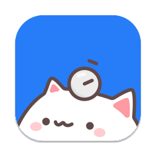

  

<h3 align="center">Isshin <i>by <a href="https://builder.group/">builder.group</a></i></h3>

  Focus toolset for better work and fewer distractions.
   
  <a href="https://isshin.app/"><strong>Learn more »</strong></a>
   
   
  <a href="#introduction"><strong>Introduction</strong></a> ·
  <a href="#products"><strong>Products</strong></a> ·
  <a href="#roadmap"><strong>Roadmap</strong></a> ·
  <a href="#tech-stack"><strong>Tech Stack</strong></a> ·
  <a href="#contributing"><strong>Contributing</strong></a>

  
  

 

> 🚧 Under construction. Coming soon 👀

## Introduction

**Isshin (一心)** is a Japanese concept meaning "one heart" or "one mind." It represents wholehearted focus on a single purpose. A unified mind without distraction.

We're building focus tools that actually work. No willpower battles. No manual switching. Tools that enforce what you decided when you had clarity.

## Products

###  FocusCat

  
  

**Free macOS app. Coming soon.**

Pomodoro timer with a cat companion that reacts to your work. Configure your cycles, block apps during focus time. Enforces breaks so you actually take them.

Fully local. No cloud, no analytics, no account.

### 📏 Abstand

**Free macOS app. Coming next.**

Digital detox missions. Pick your apps, set your days. Nothing blocks you, but every slip shows the cost to your rank. Cancel anytime, but you restart from zero.

Fully local. Optional hardcore mode if you want actual blocking.

## Roadmap

FocusCat and Abstand are experiments. Each tests a different approach to focus enforcement. If people find them useful, we'll build the full vision.

**The Isshin vision:** [Sunsama](https://sunsama.com/) (planning) + [Cold Turkey](https://getcoldturkey.com/) (blocking) + [RescueTime](https://www.rescuetime.com/) (tracking), but context-aware.

You plan your day once. Your Mac enforces it automatically. Deep work task? X/Twitter blocks. Marketing task? It opens. Your blocklist adapts to the task, not the other way around.

If we build it: native macOS app, one-time purchase, everything local.

## Tech Stack

**Frontend:** React, TypeScript, TanStack Router, Vite  
**Backend:** Tauri (Rust), SQLite, Swift  
**Tools:** pnpm, Turborepo, GitHub Actions
